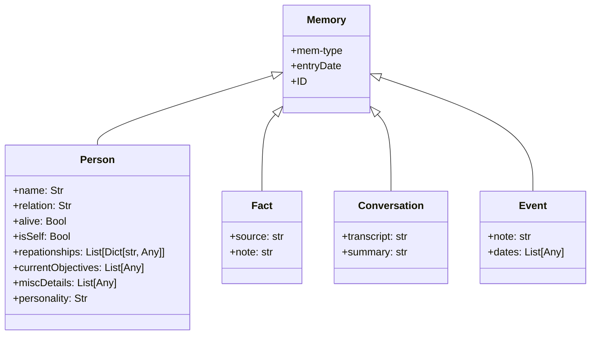
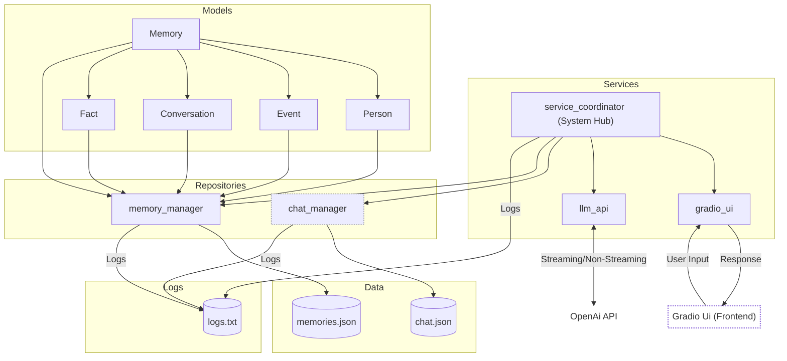

# Generative Heuristic Operations for Simulated Traits

## A Modular Framework for Dynamic Digital Personalities

### Abstract

This project introduces a modular framework designed to develop dynamic digital personalities with evolving traits and behaviors. By integrating memory management, logical reasoning, sensory processing, and decision-making capabilities, this system creates lifelike interactions where personalities organically adapt based on experiences. Drawing inspiration from iconic fictional characters like C-3PO and Marvin the Paranoid Android, the framework provides tools for building unique, context-aware assistants or robotic puppeteers for specialized tasks.

The framework emphasizes modularity, enabling seamless integration of diverse AI models to ensure efficiency and character consistency. While avoiding the ethical and philosophical challenges of true sentience, it focuses on simulating believable personalities through adaptive memory and gradual personality evolution. This approach fosters a foundation for creating assistants and digital interfaces that support rich, individualized interactions, advancing human-robot collaboration and digital character development.

---

## Key Improvements and Changes

### 1. Improved File Structure

The project’s file structure has been significantly refined to improve modularity, readability, and scalability:

```
Generative-Heuristic-Operations-for-Simulated-Traits/
├── .venv/                       # Virtual environment
├── additional docs/             # Documentation and planning files
│   ├── generated_workflow.png
│   ├── old codebase.md
│   ├── Old_readme.md
│   ├── Updated_FilePaths.txt
│   └── Updated_Plan ~ 120924.txt
├── data/                        # Persistent data storage
│   ├── chat.json
│   ├── memories.json
├── infrastructure/              # Infrastructure logic
│   ├── models/                  # Core data models
│   │   ├── init.py
│   │   ├── conversation.py
│   │   ├── event.py
│   │   ├── fact.py
│   │   ├── memory.py
│   │   └── person.py
│   ├── repositories/            # Repositories for data handling
│   │   ├── init.py
│   │   ├── chat_repository.py
│   │   ├── memory_repository.py
│   ├── services/                # Services for external integrations
│   │   ├── init.py
│   │   ├── chat_handler.py
│   │   ├── llm_service.py
│   │   ├── memory_handler.py
│   │   └── coordinator.py
├── logs/                        # Log files
│   └── memory_manager.log
├── .env                         # Environment variables
├── .gitignore                   # Git ignore file
├── config.py                    # Centralized configuration
├── main.py                      # Entry point for the application
├── README.md                    # Project documentation
```

---

### 2. Modular Architecture

The framework has been reorganized into three main layers:

#### Models Layer

- **Memory**: Abstract base class for all memory types.
- **Person**: Represents individuals with attributes such as relationships and personality.
- **Event**: Encodes notable occurrences.
- **Fact**: Stores factual information with references.
- **Conversation**: Manages conversation transcripts and summaries.

#### Infrastructure Layer
- **Repositories**:
  - `ChatRepository`: Handles persistent chat log storage.
  - `MemoryRepository`: Manages memory persistence and retrieval.
- **Services**:
  - `LLMService`: Facilitates communication with GPT models.
  - `ChatHandler`: Manages chat workflows.
  - `MemoryHandler`: Oversees memory lifecycle and summarization.
  - `Coordinator`: Orchestrates workflows between handlers and services.

#### Application Layer
- `gradio_ui.py`: Provides a web-based interface using Gradio.

---



---

## Key Features

### 1. Memory Management
- Handles multiple memory types (Person, Event, Fact, Conversation).
- Asynchronous memory retrieval and storage.
- Automated summarization of memory collections and conversations.

### 2. Chat Interaction Workflow
- Captures and processes user input through the `ChatHandler`.
- Integrates GPT-based responses via the `LLMService`.
- Maintains a structured chat log for context and continuity.

### 3. Focus on Current Implementation
- Highlights the primary features implemented, including memory management and chat workflows.
- Lays the foundation for integrating future extensibility, such as advanced personality dynamics, while keeping focus on the current status.

---

## Core Changes Made

### File Structure Overhaul
- Reorganized code into `models`, `repositories`, and `services` directories.
- Centralized application logic in `application/`.

### Improved Abstractions
- Separated LLM logic (`LLMService`) from chat workflows (`ChatHandler`).
- Isolated memory management logic in `MemoryHandler`.

### Refactored Domain Models
- Introduced a base `Memory` class for all memory types.
- Created dedicated models for `Person`, `Event`, `Fact`, and `Conversation`.

### Enhanced Asynchronous Operations
- Adopted `async/await` for memory and chat workflows.

### Centralized Configuration
- Added `config.py` for managing environment variables and settings.

### Expanded Logging
- Detailed logging across all modules for debugging and monitoring.

### Memory Summarization
- Enhanced summarization logic using GPT models.
- Integrated conversation summarization into the `Conversation` model.

### Streamlined User Interaction
- Redesigned `gradio_ui.py` for a web-based, more intuitive user experience.

---

## Future Directions

### Web Interface Expansion
- Enhance Gradio-based interaction platform with additional features.

### Multi-Personality Support
- Extend framework to manage and simulate multiple interacting personalities.

### Advanced Summarization
- Leverage GPT-4 for improved memory and event summarization.

### Visualization Tools
- Add dashboards for memory and conversation summaries.

---

This project is inspired by fictional digital personalities and aims to simulate believable, engaging interactions.
