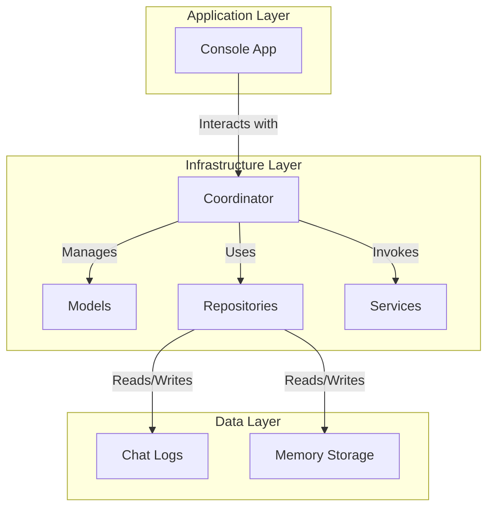
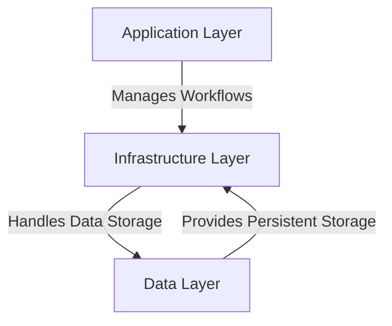

# Current State Document

## 1. Project Goals

### Core Purpose

The project aims to create a modular, extensible framework for AI-powered digital entities, enabling easy integration of tools and features. The framework focuses on adaptability, allowing developers to implement sophisticated systems with minimal complexity. It is designed for offline, self-contained operation on low-power devices like LattePanda or Raspberry Pi.

### Personality Dynamics

Thematic inspirations like C-3PO and Marvin the Paranoid Android guide the framework’s goal of enabling emergent, adaptable personalities. These are not predefined traits but context-driven behaviors evolving through memory and objectives.

### Objectives

**Immediate:**

- Develop a console chatbot with:
  - **Short-Term Memory**: Context-specific and data-rich.
  - **Long-Term Memory**: Summarized, goal-oriented, and self-aware.
- Enable autonomous memory generation and retrieval.

**Mid-Term:**

- Simplify integration of agent tools (e.g., web browsing, sensor inputs).
- Transition to a user-friendly interface.

**Long-Term:**

- Automate memory lifecycle management (e.g., summarization, culling).
- Add multimodal capabilities (e.g., TTS/VTT, visual input).
- Optimize for lightweight, efficient operation.

### Constraints

- Focus on usability and modularity for easy feature integration.
- Ensure offline operation and compatibility with low-power devices.

---

## 2. Architecture Updates

### Current Architecture




The project is organized to prioritize modularity and clarity, aligning with the framework’s goal of simplifying feature integration and maintenance. Below is the current file structure:

```
Generative-Heuristic-Operations-for-Simulated-Traits/
├── application/
│   ├── __init__.py          # Application initialization
│   └── console_app.py       # Console-based user interface
├── data/
│   ├── chat.json            # Persistent chat log storage
│   ├── memories.json        # Persistent memory storage
│   └── memories_backup.json # Backup of memory storage
├── infrastructure/
│   ├── models/              # Core data structures for the domain
│   │   ├── __init__.py
│   │   ├── conversation.py  # Conversation model
│   │   ├── event.py         # Event model
│   │   ├── fact.py          # Fact model
│   │   ├── memory.py        # Abstract base for memory
│   │   └── person.py        # Person model
│   ├── repositories/        # Handles data persistence
│   │   ├── __init__.py
│   │   ├── chat_repository.py # Chat log repository
│   │   └── memory_repository.py # Memory repository
│   ├── services/            # Business logic and external service interactions
│   │   ├── __init__.py
│   │   ├── chat_handler.py  # Manages chat workflows
│   │   ├── llm_service.py   # Interacts with the language model
│   │   └── memory_handler.py # Manages memory operations
│   └── coordinator.py       # Links chat and memory workflows
├── additional docs/
│   ├── generated_workflow.png # Workflow visualization
│   ├── old codebase.md        # Log of earlier iterations
│   ├── Updated_FilePaths.txt  # Current file structure
│   └── Updated_Plan ~ 120924.txt # Future roadmap and plan
├── config.py                 # Centralized settings and parameters
├── main.py                   # Entry point for the application
├── requirements.txt          # Dependency management
├── .env                      # Environment variables
├── .gitignore                # Git exclusion rules
└── README.md                 # Project overview and instructions
```

### Key Characteristics

1. **Layered Organization**:

   - **Application Layer**: Manages user interaction and workflows (e.g., `console_app.py`).
   - **Infrastructure Layer**: Includes core models, repositories, and services for data and workflow management.
   - **Data Layer**: Stores persistent data in JSON format for simplicity and portability.

2. **Data Persistence**:

   - Persistent chat and memory data are stored in the `data/` directory as JSON files.

3. **Configurability**:

   - Settings are centralized in `config.py` to ensure flexibility and reduce hardcoding.

### Inter-Layer Interaction



- **Application ↔ Infrastructure**: The application layer uses the `Coordinator` to manage workflows across services like chat handling and memory summarization.
- **Infrastructure ↔ Data**: Repositories handle all interactions with JSON storage, abstracting data handling from higher-level logic.

---

## 3. Functional Overview

### Current Functionality

1. **Console Chat Interface**:

   - Users can interact with the chatbot via the command-line interface provided by `console_app.py`.
   - Input is processed, and responses are generated using an LLM.

2. **Memory Management**:

   - **Conversation Storage**: Chat sessions are stored as `Conversation` objects with summaries highlighting key details.
   - **Memory Summarization**: The program generates a cohesive summary of all available memories in storage.

3. **LLM Integration**:

   - LLMs are used to:
     - Generate responses during chats.
     - Summarize individual conversations.

### Experimental Status

- The system is functional but unpolished, with workflows validated through runtime observations rather than rigorous testing.
- Inefficiencies include redundant summarizations and excessive token usage.

---

## 4. Codebase Status

### Current State

1. **Logging**:

   - Logging is inconsistent and lacks clarity.
   - Logs need standardized formatting and structured levels (INFO, DEBUG, ERROR).

2. **Initialization and Shutdown**:

   - Startup and shutdown workflows are clunky and inefficient.
   - Redundant summarizations increase token usage, and payloads sent to the LLM are overly large.

3. **Memory Management**:

   - Summaries are repeatedly generated instead of reused, leading to inefficiency.

4. **SELF Model**:

   - The assistant lacks a structured "SELF" model to track identity and traits.

5. **Comments and Docstrings**:

   - Many comments and docstrings are outdated, unclear, or missing.

6. **Agent Instructions**:

   - Instructions are not currently sent to the agent, and the need for this feature is still under consideration.

### Areas for Improvement

1. **Logging**: Standardize logs and include more contextual information.
2. **Initialization and Shutdown**: Optimize workflows and minimize redundant summarizations.
3. **Memory Management**: Reuse existing summaries to improve efficiency.
4. **SELF Model**: Create a dedicated model for assistant identity.
5. **Comments and Docstrings**: Rewrite documentation to reflect current functionality accurately.

---

## 5. Testing and Debugging

### Current Status

- Testing is minimal, with most validation performed through runtime observations.
- Debugging relies on ad-hoc logs and manual inspection.

### Immediate Goals

1. **Basic Unit Tests**:

   - Focus on critical areas like memory handling and chat workflows.
   - Avoid overengineering; keep tests lightweight.

2. **Improved Debugging**:

   - Standardize logging with detailed, structured messages.
   - Use log levels (INFO, DEBUG, ERROR) for better issue identification.

3. **Workflow Validation**:

   - Write minimal tests to ensure end-to-end workflows (e.g., chat sessions, memory summarization) operate as expected.

### Future Considerations

- Incrementally expand test coverage as components stabilize.
- Focus on debugging efficiency by improving logs and adding traceability.
- Automate tests only after core workflows are stable.

---

