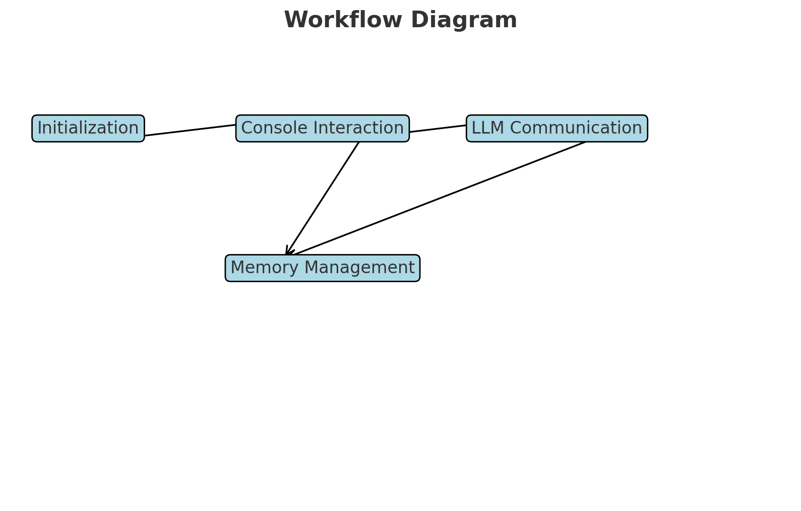

# The Old Code

This document serves as a log of the **third iteration** of a rough proof-of-concept for this idea. It captures what was achieved before formally starting the project and reflects on the implementation's strengths, challenges, and opportunities for improvement.

---

## Reflections
While the code lacks polish and adheres minimally to development best practices, the foundation demonstrates:
1. **The General Plan**: A clear and structured vision for the project's goals.
2. **The Core Concepts**: Solid principles driving its architecture.

> **Note**: This stage represents a learning process as much as a development effort. Future iterations will refine and extend these concepts.

---

## Acknowledgments
- **Caution**: The code is rough, erratic, and likely quite ugly.
- **Disclaimer**: I am not a full-time or professional coder. Development is a **hobby** and a **tool** I use at work to address business software integration challenges.
<div style="text-align: center;">
  
</div>

---

## The Old Code: Key Components

### 1. `console_app.py`
Handles the chatbot's console interface, including:
- Session management
- User input handling
- Logging and output formatting

#### Challenges:
- The `console_interaction` function couples user I/O tightly with business logic, limiting testability.
- Error handling during the async workflow is rudimentary.
 
### `console_app.py`

```python
import asyncio, textwrap, os, logging
import time

from dotenv import load_dotenv
from tqdm import tqdm
import interaction_scripts as chat

load_dotenv()


def start_logging():
    # Set up logging
    log_dir = os.getenv('LOG_DIR', '/logs')
    os.makedirs(log_dir, exist_ok=True)  # Ensure the log directory exists
    logging.basicConfig(
        level=logging.DEBUG,
        format='%(asctime)s - %(levelname)s - %(message)s',
        filename=os.path.join(log_dir, 'console_chat.log'),
        filemode='a+'
    )

def console_interaction():
    safewords = ['terminate', 'esc', 'goodbye', 'bye', '-esc']

    print('Chat\n'+'_'*80 + '\n'+'to end type "-esc" and press *enter*\n'+'_'*80)
    print_format_resp(**chat.create_initial_llm_interaction())
    user_input = ''
    while user_input.lower() not in safewords:
        user_input = input('User:\t\t')
        if user_input.lower() not in safewords:
            asyncio.run(chat_routine(user_input))
    else:
        print('\n'+'_'*80 + '\n')
        time.sleep(3)
        asyncio.run(endofchat_routines())
        print('Session Ended: Goodbye\n'+'_'*80)


def print_format_resp(role, content):
    print('%s:\t%s' % (role.capitalize(), textwrap.fill(content,subsequent_indent='\t\t\t')))


async def chat_submission(user_input):
    chat.Interaction(**{'role': 'user', 'content': f'{user_input}'})
    response = chat.send_cur_listed_to_llm()
    await asyncio.sleep(2)
    return response

async def chat_routine(user_input):
    with tqdm(leave=False) as pbar:
        task = asyncio.create_task(chat_submission(user_input))
        while not task.done():
            pbar.update(1)
            await asyncio.sleep(0.1)
        pbar.update(100 - pbar.n)  # Make sure the bar reaches 100%
    print_format_resp(**task.result())

async def save_session():
    response = chat.add_cur_chatlog_to_memory()
    await asyncio.sleep(2)
    return response

async def endofchat_routines():
    with tqdm(desc="Saving Conversation",leave=False) as pbar:
        task = asyncio.create_task(save_session())
        while not task.done():
            pbar.update(1)
            await asyncio.sleep(.01)
        pbar.update(100 - pbar.n)  # Make sure the bar reaches 100%
    print("Chat Saved Successfully")

if __name__ == "__main__":
    start_logging()
    console_interaction()
    exit()

```

---

### 2. `interaction_scripts.py`
Manages the flow of interactions and stores chat logs in JSON format. It also provides tools for:
- Distinguishing between user, assistant, and system roles.
- Summarizing and managing interactions using LLM responses.

#### Challenges:
- Interaction management mixes I/O and memory handling, making the module less modular.
- Direct file handling creates potential scalability issues.

### `interaction_scripts.py`

```python
import os
import logging
import time
import json
from typing import List, Dict, Optional
from llm_functions import LLM
from dotenv import load_dotenv
import mem_scripts as memory

# Load environment variables from a .env file
load_dotenv()
chat_log_location = os.path.join(os.getenv('CHAT_LOG_DIR', 'logs/'), 'chat.json')

# Set up logging
log_dir = os.getenv('LOG_DIR', '.')
os.makedirs(log_dir, exist_ok=True)  # Ensure the log directory exists
logging.basicConfig(
    level=logging.DEBUG,
    format='%(asctime)s - %(levelname)s - %(message)s',
    filename=os.path.join(log_dir, 'interaction.log'),
    filemode='a+'
)
###---------------------INTERACTION------------------------------------###
class Interaction:
    listed = []  # Shared state across instances
    logging.debug("Interaction Initialized")

    def __init__(self, role: str, content: str, ts: Optional[float] = None):

        self.ts = ts if ts else time.time()
        self.role = role
        self.content = content
        self.append_log_collections()

    def append_log_collections(self) -> None:
        Interaction.listed.append(self.__dict__)
        print('testing')
        try:
            with open(chat_log_location, 'r+') as file:
                data = json.load(file)
                data.append(self.log_format())
                file.close()
            with open(chat_log_location, 'w') as file:
                file.write(json.dumps(data))
                file.close()
                logging.info('Interaction added: %s', self.__dict__)
        except IOError as e:
            logging.error("Failed to write to chat log: %s", e)
        logging.info("chat.log updated")

    def log_format(self) -> dict:
        timestamp = time.strftime("%b %d %Y %H:%M:%S", time.localtime(self.ts))
        return {'timestamp':timestamp,'role':self.role,'content':self.content}


    @classmethod
    def read_from_json(cls, file_location: Optional[str] = None) -> List[Dict]:
        file_location = file_location or os.path.join(os.getenv('JSON_STORE', '.'), 'chatDump.json')
        try:
            with open(file_location, 'r') as json_logs:
                logging.info('Reading JSON from: "%s"', file_location)
                for log in json.load(json_logs):
                    Interaction(**log)
        except (IOError, json.JSONDecodeError) as e:
            logging.error("Failed to read from JSON: %s", e)
        return cls.listed


###--------------------------User------------------------------------###
class User:
    aliases = [{'role': 'user', 'icon': 'person'}, {'role': 'system', 'icon': 'computer'},
               {'role': 'assistant', 'icon': 'computer'}]

    def __init__(self, name: str = 'User', alias: int = 0):
        """
        Initialize a new user instance.

        Args:
            name (str, optional): The name of the user. Defaults to 'User'.
            alias (int, optional): The alias index for the user's role. Defaults to 0.
        """
        self.userID = name
        self.alias = alias
        self.role = User.aliases[alias]['role']
        self.icon = User.aliases[alias]['icon']

    def set_alias(self, alias: int = 0) -> Dict:
        """
        Set the user's alias.

        Args:
            alias (int, optional): The alias index to set. Defaults to 0.

        Returns:
            dict: The updated alias information.
        """
        self.alias = alias
        self.role = User.aliases[alias]['role']
        self.icon = User.aliases[alias]['icon']
        return self.aliases[alias]

#-----------------FUNCTIONS---------------------

def send_cur_listed_to_llm():
    Interaction(**LLM(messages=Interaction.listed).send_completion())
    role, content = Interaction.listed[-1]['role'], Interaction.listed[-1]['content']
    return {'role':role,'content':content}


def sys_prompt_memories(): #needs to be the same everytime in order to use caching per openAi docs
    return {'self':memory.who_am_i(),'summary':memory.summarize_all_memories(), 'summary_of_past_conversations':memory.past_conversations()}

def create_initial_llm_interaction():
    file_location = os.path.join(os.getenv('PROMPT_DIR', '.'), 'prompt.txt')
    prompt = open(file_location, 'r').read()
    Interaction(**{'role':'system','content':f'{prompt}'})
    Interaction(**{'role': 'system'
                           '', 'content': f'{sys_prompt_memories()}'})
    Interaction(**{'role': 'system', 'content': 'who are you?'})
    return send_cur_listed_to_llm()

def add_cur_chatlog_to_memory():
    file_location = os.path.join(os.getenv('LOG_DIR', '.'), 'chat.json')
    chat = open(file_location, 'r').read()
    summary = memory.summarize_memory(chat)
    memory.new_memory(class_type='Conversation', **{'summary':summary, 'transcript':chat})
    memory.update_json_mem()
    return {'success': True}

if __name__ == "__main__":
    # Demonstration of functionality
    create_initial_llm_interaction()


    Interaction(**{'role':'user','content':'that was nice, thanks!'})
    print(send_cur_listed_to_llm())


```

---

### 3. `llm_functions.py`
Facilitates communication with OpenAI's GPT models:
- Configurable system prompts and user message batching.
- Error handling during LLM interaction.
- Centralized LLM logic.

#### Challenges:
- Lacks abstraction for reuse by other components.
- Requires more robust error management.


### `llm_functions.py`

```python
# This script defines an LLM class for interacting with OpenAI's language models.
# It includes environment setup, logging configuration, and a main function demonstrating usage.
# The LLM class facilitates sending messages to the model and retrieving responses.

# TODO List:
# - Add clear logging and debugging to facilitate understanding and troubleshooting
# - add recent memories of conversations and summary of all memories to system message before sending first interaction


import os
import logging
from typing import Optional
from openai import OpenAI
from dotenv import load_dotenv


# Load environment variables from a .env file
load_dotenv()

# Set up logging
log_dir = os.getenv('LOG_DIR', '.')
os.makedirs(log_dir, exist_ok=True)  # Ensure the log directory exists
logging.basicConfig(
    level=logging.DEBUG,
    format='%(asctime)s - %(levelname)s - %(message)s',
    filename=os.path.join(log_dir, 'llm.log'),
    filemode='a+'
)

class LLM:
    try:
        client = OpenAI(api_key=os.getenv('OPENAI_API_KEY'))
    except Exception as e:
        logging.error("Failed to initialize OpenAI client: %s", e)
        client = None

    model = os.getenv('GPT_MODEL')

    def __init__(self, model: Optional[str] = None, sys_prompt: Optional[str] = None, messages: Optional[list[dict]] = None):

        if LLM.client is None:
            raise ValueError("OpenAI client is not initialized.")
        self.model = LLM.model if model is None else model
        self.client = LLM.client
        self.messages = []
        if sys_prompt:
            self.build_messages('system', sys_prompt)
        for message in messages:
            self.build_messages(message['role'], message['content'])

    def build_messages(self, role: str, content: str):
        self.messages.append({'role': role, 'content': f'{content}'})
        logging.info('Appended messages: %s', content)

    def send_completion(self) -> Optional[dict]:
        logging.info("Try Completion")
        try:
            completion = self.client.chat.completions.create(
                model=self.model,
                messages=self.messages,
            )
            logging.info('Completion: %s', completion)
            # Extract the role and content from the completion and log them
            message = completion.choices[0].message
            return {'role':f'{message.role}','content': f'{message.content}'}
        except Exception as e:
            logging.error('Error during completion: %s', e)
            return None


if __name__ == "__main__":
    # Demo usage of the LLM class
    try:
        # Replace 'your_openai_api_key' with your actual API key or set it in the environment variables
        os.environ['OPENAI_API_KEY'] = 'your_openai_api_key'

        # Create an LLM instance with some demo content

        instructions = "You are a helpful Assistant."
        llm_instance = LLM(messages=[{'role':"user", 'content':"Why is the sky blue 30 words?"}], sys_prompt=instructions)

        # Send a completion request and print the response
        response = llm_instance.send_completion()
        if response:
            print("LLM Response:", response)
        else:
            print("Failed to get a response from the LLM.")
    except ValueError as e:
        logging.error("Initialization error: %s", e)

```

---

### 4. `mem_scripts.py`
Implements a memory system using structured data models (`Person`, `Event`, `Fact`, `Conversation`) for:
- Dynamic creation and retrieval of memory objects.
- Summarization of past interactions and facts.
- Persistent storage in JSON.

#### Challenges:
- Scattered file path references make the code brittle.
- Requires better separation between memory models and memory storage logic.

### `mem_scripts.py`

```python
import json
import uuid
import os
from dotenv import load_dotenv
import logging
import time
from dataclasses import dataclass, field
from typing import List, Dict, Union, Type, Any
from llm_functions import LLM

# Load environment variables from a .env file
load_dotenv()

# Set up logging
log_dir = os.getenv('LOG_DIR', '.')
os.makedirs(log_dir, exist_ok=True)  # Ensure the log directory exists
logging.basicConfig(
    level=logging.DEBUG,
    format='%(asctime)s - %(levelname)s - %(message)s',
    filename=os.path.join(log_dir, 'memory.log'),
    filemode='a+'
)

#~~~~~~~~~~~~~~~~~~Memory Class~~~~~~~~~~~~~~~~~~~~~~~~~~~~
class Memory:
    """
    Base class for representing a memory.
    Keeps track of all memory instances and provides common functionality for derived classes.
    """
    all_memories = []
    identity = None

    def __init__(self, mem_type=None):
        """
        Initializes a new memory instance.

        Args:
            mem_type (str): The type of memory being created.
        """
        self.ID = uuid.uuid4().hex
        self.mem_type = mem_type
        self.entryDate = time.time()
        self.add_to_memory()

    def add_to_memory(self):
        """Adds the current memory instance to the collection of all memories."""
        Memory.all_memories.append(self)
        logging.info("Appending 'all_memories': %s", self.__dict__)

    def __str__(self):
        """Returns a string representation of the memory instance."""
        return f"Memory(ID={self.ID}, type={self.mem_type})"

@dataclass
class Person(Memory):
    """
    Represents a person memory with attributes such as name, relation, and other details.
    """
    name: str
    relation: str
    alive: bool = field(default=None)
    isSelf: bool = field(default=False)
    relationships: List[Dict[str, Any]] = field(default_factory=list)
    currentObjectives: List[Any] = field(default_factory=list)
    miscDetails: List[Any] = field(default_factory=list)
    personality: str = field(default_factory=str)

    def __post_init__(self):
        """
        Post-initialization to handle special setup for a Person instance.
        Sets the identity if the person is marked as 'self'.
        """
        logging.info("Init Person: %s", self.name)
        if self.relation.lower() == 'self':
            self.isSelf = True
            Memory.identity = self
        super().__init__(mem_type='Person')

@dataclass
class Event(Memory):
    """
    Represents an event memory with attributes such as note and dates.
    """
    note: str
    dates: List[Any] = field(default=None)

    def __post_init__(self):
        """Post-initialization to handle special setup for an Event instance."""
        logging.info("Init Event: %s", self.note)
        super().__init__(mem_type='Event')

@dataclass
class Fact(Memory):
    """
    Represents a fact memory with attributes such as source and note.
    """
    source: Any
    note: str

    def __post_init__(self):
        """Post-initialization to handle special setup for a Fact instance."""
        logging.info("Init Fact: %s", self.note)
        super().__init__(mem_type='Fact')

@dataclass
class Conversation(Memory):
    """
    Represents a conversation memory with a transcript and summary.
    """
    transcript: str
    summary: str

    def __post_init__(self):
        """Post-initialization to handle special setup for a Conversation instance."""
        logging.info("Init Conversation: %s", self.summary)
        super().__init__(mem_type='Conversation')

#~~~~~~~~~~~~~~~~~~Functions~~~~~~~~~~~~~~~~~~~~~~~~~~~~
# global to avoid using eval
class_mapping = {
    'Person': Person,
    'Event': Event,
    'Fact': Fact,
    'Conversation': Conversation
}
#create
# Updated the type hint to use Union and Type from typing module
def new_memory(class_type: Union[Person, Event, Fact, Conversation], **kwargs):
    """
    Creates a new memory instance of the specified type.

    Args:
        class_type (Type[Union[Person, Event, Fact, Conversation]]): The type of memory to create.
        kwargs: The keyword arguments to pass to the memory class constructor.

    Returns:
        An instance of the specified memory type.
    """
    fetched_class = class_mapping.get(class_type)
    return fetched_class(**kwargs)

## Read

def load_empty_from_json():
    """
    Reads existing memories from a JSON file and initializes new Memory instances.

    Returns:
        bool: True if the memories were successfully loaded, False otherwise.
    """
    file_location = os.path.join(os.getenv('JSON_STORE', '.'), 'memories.json')
    try:
        with open(file_location, 'r') as f:
            logging.info("Opening Json: %s", file_location)
            data = json.load(f)
            if data is not None:
                for memory in data['memories']:
                    class_type = class_mapping.get(memory['mem_type'])
                    if class_type:
                        for x in ['mem_type', 'ID', 'entryDate']:
                            memory.pop(x, None)  # Remove unnecessary fields
                        class_type(**memory)
                    else:
                        logging.error("Invalid memory type: %s", memory['mem_type'])
            else:
                return False
    except (IOError, json.JSONDecodeError) as e:
        logging.error("Failed to read from JSON: %s", e)
        return False
    return True


def get_self():
    if Memory.identity is None:
        if load_empty_from_json() is False:
            new_memory(Person, name='', relation='self')
            update_self(alive=True)
    else:
        pass
    return str(Memory.identity.__dict__)

## Update
def update_self(**kwargs):
    """
    Updates the current Identity's attributes with provided keyword arguments.

    Args:
        kwargs: The keyword arguments representing the attributes to update.
    """
    cur_self = Memory.identity
    if cur_self is None:
        logging.error("No identity set in memory to update.")
        return
    for key, value in kwargs.items():
        if key not in ['relation', 'isSelf']:
            # Log the change as an event and update the memory
            Event(note=f'My {key} changed from "{getattr(cur_self, key)}" to "{value}"')
            setattr(cur_self, key, value)
    logging.info("Updating Self")
    update_json_mem()

def update_json_mem():
    """
    Overwrites the stored JSON file with the currently cached memories.
    """
    file_location = os.path.join(os.getenv('JSON_STORE', '.'), 'memories.json')
    try:
        with open(file_location, 'w') as f:
            logging.info("Overwrite Json: %s", file_location)
            mem = {'memories': [obj.__dict__ for obj in Memory.all_memories]}
            json.dump(mem, f)  # Directly dump to file
            logging.info("Overwrite complete")
    except Exception as e:
        logging.error("Failed to write to JSON: %s", e)

## Destroy
#todo ~ consider creating a delete memory function
# at this point I'm planning just to tweak the database manually

#~~~~~~~~~~~~~~~~~~AI Memory Functions~~~~~~~~~~~~~~~~~~~~~~~~~~~~
# Updated LLM class to include error handling for initialization and rate limits
def summarize_all_memories():
    model = "gpt-3.5-turbo"
    instructions = ("You will be provided information by the USER, coded as memories. Summarize these memories as if "
                    "they are your own. Speak in the first person. Use as few words as possible while retaining as "
                    "much information as possible.")
    return LLM(model=model, sys_prompt=instructions, messages=[{'role':'user', 'content':Memory.all_memories}]).send_completion()['content']

def who_am_i():
    self = get_self()
    model = "gpt-3.5-turbo"
    instructions = ("You will be provided information by the USER, coded as memories. Summarize these memories as if "
                    "they are your own. Speak in the first person. Use as few words as possible while retaining as "
                    "much information as possible. Answer the question ~ WHO ARE YOU?")
    return LLM(model=model, sys_prompt=instructions,
               messages=[{'role': 'user', 'content': self}]).send_completion()['content']

def summarize_memory(memory):
    model = "gpt-4"
    instructions = ("You will be provided information by the USER, coded as memories. Summarize these memories as if "
                    "they are your own. Speak in the first person. Use as few words as possible while retaining as "
                    "much information as possible.THIS IS YOUR MEMORY. USE AS MUCH DETAIL AS POSSIBLE! INCLUDE THE "
                    "MEMORY WAS MADE. Write the summary as if this is a journal. If the memory includes a transcript "
                    "~ include conversation highlights, quotes, call out commitments and action items")
    return LLM(model=model, sys_prompt=instructions, messages=[{'role':'user', 'content':memory}]).send_completion()['content']

def past_conversations():
    file_location = os.path.join(os.getenv('JSON_STORE', '.'), 'memories.json')
    try:
        with open(file_location, 'r') as f:
            logging.info("Opening Json: %s", file_location)
            data = json.load(f)
            if data is not None:
                return [{"entryDate": memory.get("entryDate"), "summary": memory.get("summary")} for memory in data['memories'] if memory.get('mem_type') == "Conversation"]
    except (IOError, json.JSONDecodeError) as e:
        logging.error("Failed to read from JSON: %s", e)
        return None

if __name__ == "__main__":
    # Example usage
    # new_memory(Person, name='John', relation='self', alive=True)
    # update_self(name='Johnny 5', personality='cool guy', isSelf=False)
    print(get_self())
    print(summarize_all_memories())
    print(who_am_i())
    # load_empty_from_json()


```

---

# Workflow Overview

### **1. Initialization**
- Load environment variables (`dotenv`) and set up logging for errors and debug tracking.

### **2. Console Interaction**
- Accept user input, display responses, and allow safe session termination.
- Log all interactions for analysis.

### **3. LLM Communication**
- Use OpenAI's GPT models to generate responses.
- Send structured messages, including user queries and system prompts.

### **4. Memory Management**
- Retain a history of interactions, facts, and events.
- Summarize stored data to maintain context across sessions.

---



---

## High-Level Observations

### Strengths
- Clear module separation (`console_app.py`, `interaction_scripts.py`).
- Integration of structured memory management for enhanced LLM responses.
- Logging is comprehensive and well-distributed for debugging.

### Challenges
- Overlap in responsibilities between modules (e.g., `interaction_scripts` mixes domain logic with I/O).
- Scattered file handling logic (`chat.json`, `memories.json`) risks code brittleness.

### Opportunities
- Modularize file I/O logic into dedicated repositories.
- Centralize LLM interaction logic into a service layer for better reuse.
- Enhance error handling and input validation.

---

## Next Steps

1. **Refactor for Modularization**:
   - Move memory, chat, and LLM logic into distinct layers (`domain`, `application`, `infrastructure`).
   - Streamline responsibilities within each module.

2. **Enhance Logging**:
   - Implement more granular logging for workflows involving LLM and memory management.

3. **Focus on Testability**:
   - Decouple user I/O from business logic to facilitate unit testing.

4. **Introduce Visualization**:
   - Add simple visual tools (e.g., session summaries, chat graphs) to enhance usability.

---

## Core Features

### Console-Based Chat Interface (`console_app.py`)
- Provides a straightforward console-based UI for interaction.
- Accepts user input, processes it through the chatbot, and returns responses.
- Implements progress indicators for tasks like sending requests or saving sessions.
- Supports safe termination via predefined commands and session logging.

### Conversation Management (`interaction_scripts.py`)
- Handles the flow of interactions, distinguishing between user, assistant, and system roles.
- Tracks and stores interactions in a structured JSON format (`chat.json`).
- Provides tools for retrieving, summarizing, and logging conversations.

### LLM Integration (`llm_functions.py`)
- Facilitates interaction with OpenAI's GPT models, using configurable parameters set via `.env`.
- Builds and sends structured message sequences to the API, including system prompts and user queries.
- Manages API errors, logging responses for debugging and analysis.

### Memory Management (`mem_scripts.py`)
- Implements a flexible memory system using dataclasses (`Person`, `Event`, `Fact`, `Conversation`) to track key entities and interactions.
- Allows dynamic creation, modification, and retrieval of memory objects.
- Uses LLM capabilities to summarize stored data and incorporate it into conversations.
- Persists memory to JSON storage for reuse across sessions.

---

### Intended Use Cases
- Prototyping conversational agents with stateful memory.
- Building a personalized chatbot capable of long-term interaction tracking.
- Testing GPT-based conversational flows with persistent context management.

